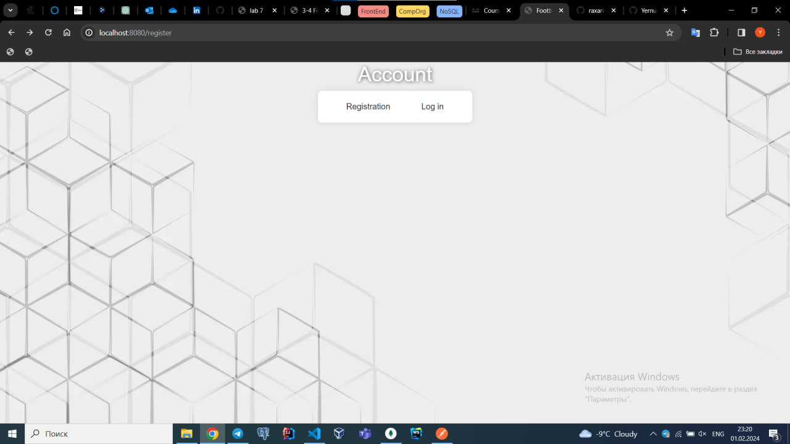
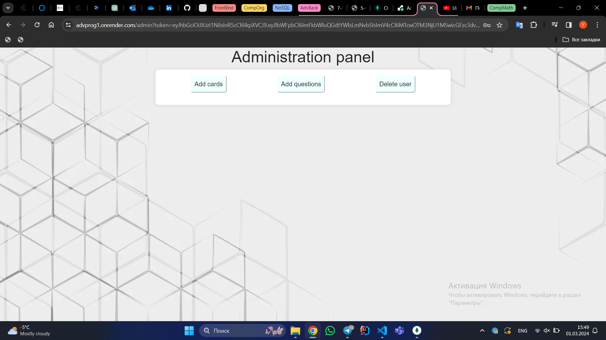
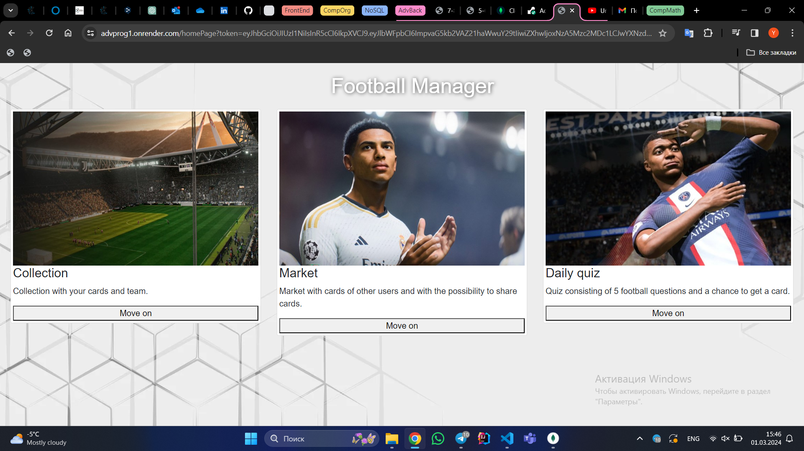
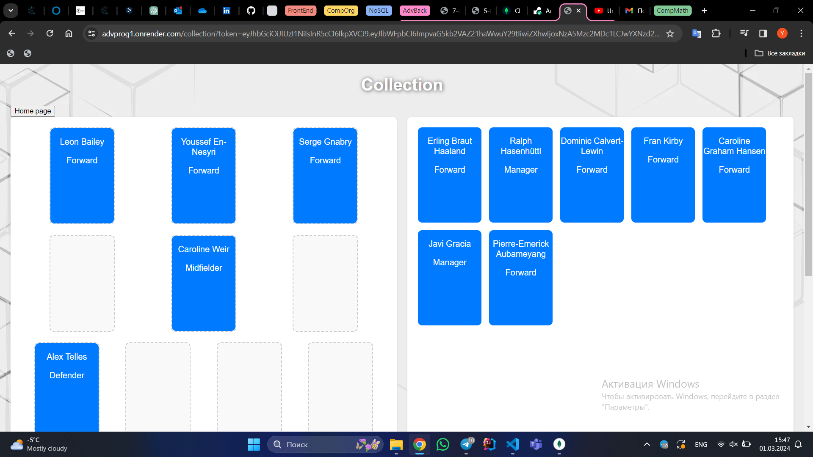
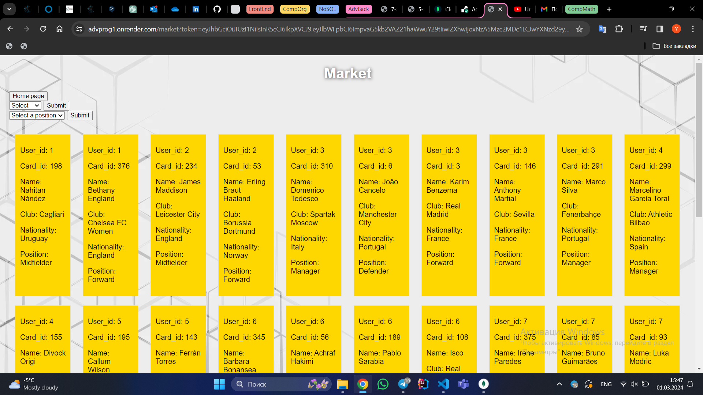
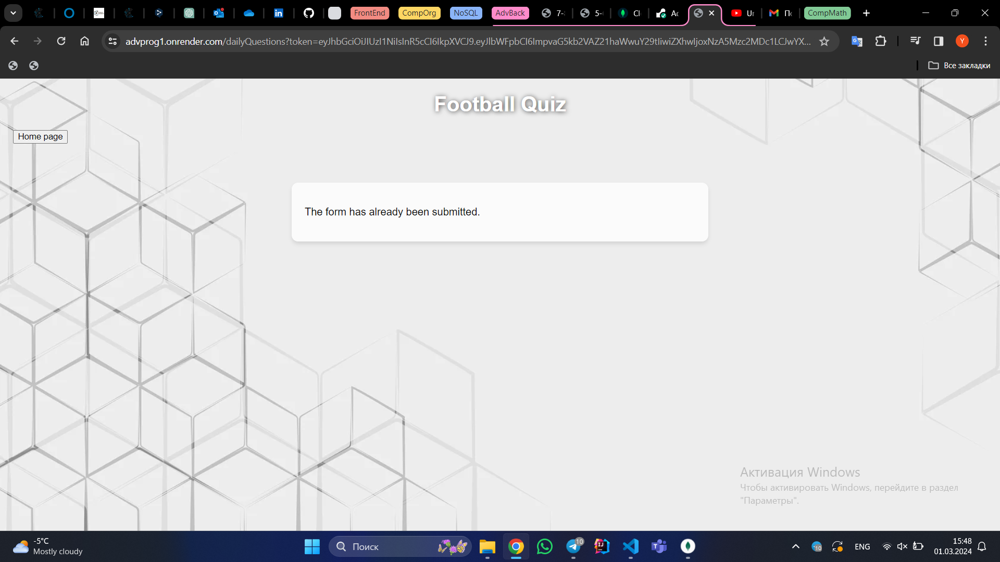

# FOOTBALL TOOLS

## Project description
Footbal Tools is web application for footbal enthusiasts where they can create and manage their favourite teams. Player cards are dropping after answering to questions. (not finished)

## Participants:
Ydrys Angsat, Yernur Nurlanov

## Getting started
1. Install the necessary dependencies:
```
go get -u github.com/gorilla/mux
go get -u golang.org/x/time/rate
go get -u github.com/natefinch/lumberjack
go get -u go.mongodb.org/mongo-driver/mongo
go get -u github.com/sirupsen/logrus
```
2. Install MongoDB and make sure that the MongoDB server is running at ```mongodb://127.0.0.1:27017/```
3. Create a MongoDB database named ```football_tools```, collections named ```cards_in_deals``` and ```users```, and import the files from the ```data``` folder.
4. Run your project: ```go run main.go```
5. Open a web browser and go to ```http://localhost:8080/register``` to access the registration page.
## Screenshots
### Registration page

### Admin page

### Home page

### Collection page

### Market page

### Daily Card page

